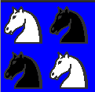
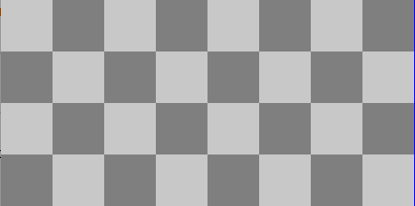

<div align="center">
<table>
    <theader>
        <tr>
            <td></td>
            <th>
                <span style="font-weight:bold;">UNIVERSIDAD NACIONAL DE SAN AGUSTIN</span><br />
                <span style="font-weight:bold;">FACULTAD DE INGENIERÍA DE PRODUCCIÓN Y SERVICIOS</span><br />
                <span style="font-weight:bold;">DEPARTAMENTO ACADÉMICO DE INGENIERÍA DE SISTEMAS E INFORMÁTICA</span><br />
                <span style="font-weight:bold;">ESCUELA PROFESIONAL DE INGENIERÍA DE SISTEMAS</span>
            </th>
            <td></td>
        </tr>
    </theader>
    <tbody>
        <tr><td colspan="3"><span style="font-weight:bold;">Formato</span>: Guía de Práctica de Laboratorio</td></tr>
        <tr><td><span style="font-weight:bold;">Aprobación</span>:  2022/03/01</td><td><span style="font-weight:bold;">Código</span>: GUIA-PRLD-001</td><td><span style="font-weight:bold;">Página</span>: 1</td></tr>
    </tbody>
</table>
</div>

<div align="center">
<span style="font-weight:bold;">GUÍA DE LABORATORIO</span><br />
</div>


<table>
<theader>
<tr><th colspan="6">INFORMACIÓN BÁSICA</th></tr>
</theader>
<tbody>
<tr><td>ASIGNATURA:</td><td colspan="5">Programación Web 2</td></tr>
<tr><td>TÍTULO DE LA PRÁCTICA:</td><td colspan="5">Python</td></tr>
<tr>
<td>NÚMERO DE PRÁCTICA:</td><td>04</td><td>AÑO LECTIVO:</td><td>2022 A</td><td>NRO. SEMESTRE:</td><td>III</td>
</tr>
<tr>
<td>FECHA INICIO::</td><td>16-May-2022</td><td>FECHA FIN:</td><td>20-May-2022</td><td>DURACIÓN:</td><td>04 horas</td>
</tr>
<td>ESTUDIANTES:</td><td colspan ="3"><li>Luis Ayben Chahua Charca</li><li>Luis Fernando Chambi Orosco</li> </td><td>NOTA:</td><td ></td>
</tr>
<tr><td colspan="6">DOCENTES:
<ul>
<li>Richart Smith Escobedo Quispe</li>
</ul>
</td>
</<tr>
</tdbody>
</table>


## 1 EJERCICIOS PROPUESTOS
-  Dibuje las siguientes figuras (invoque a draw):

            *    (a) 

            *    (b) 

            *    (c) 

            *    (d) 

            *    (e) 

            *    (f) 

            *    (g) 


   -  Ejercicio2a.py
   En este problema copio la lista(KNIGHT) para poder usarlo en la funcion invertir(ubicado picture.py)que hara cambiar la lista los caracteres de "." a "@"
   con lo cual invertira el color gracias al color.py  luego ejecuto la funcion map que ejecuta una función especificada(func) para cada elemento en un iterable los traformo en un picture para finalmete invocarlo con el draw
     ```sh
    from interpreter import draw
    from chessPictures import *
    KNIGHTN=KNIGHT.copy()
   invertir(KNIGHTN,"@")
   x = KNIGHT+KNIGHTN
   y= KNIGHTN+KNIGHT
   def func(a, b,):
  return a+b
   x = map(func, (x),(y))
  tablero=Picture(list(x))
  draw(tablero)
        ```


  -  Ejercicio2c.py
  Ejecuto la funcion map que ejecuta una función especificada(func) para cada elemento en un iterable los trasformo en un picture para finalmete invocarlo con el draw
     ```sh
    from interpreter import draw
from chessPictures import *
def func(a, b,c,d):
  return a+b+c+d
x = map(func, (QUEEN),(QUEEN),(QUEEN),(QUEEN))
tablero=Picture(list(x))
draw(tablero)
        ```
  -  Ejercicio2e.py
   En este problema copio la lista(SQUAREN) para poder usarlo en la funcion invertir(ubicado picture.py)que hara cambiar la lista los caracteres de "_" a "="
   con lo cual invertira el color gracias al color.py  luego ejecuto la funcion map que ejecuta una función especificada(func) para cada elemento en un iterable los traformo en un picture para finalmete invocarlo con el draw
     ```sh
 from interpreter import draw
from chessPictures import *
def func(a, b,c,d,e,f,g,h):
  return a+b+c+d+e+f+g+h
SQUAREN=SQUARE.copy()
invertir(SQUAREN,"=")
x = map(func, (SQUAREN),(SQUARE),(SQUAREN),(SQUARE),(SQUAREN),(SQUARE),(SQUAREN),(SQUARE))
tablero=Picture(list(x))
draw(tablero)
        ```


## 2 SOLUCION DEL CUESTIONARIO
-   ¿Qué son los archivos *.pyc?
-   ¿Para qué sirve el directorio __pycache__?
-   ¿Cuáles son los usos y lo que representa el subguión en Python?

## 3 CONCLUSIONES


## RETROALIMENTACION GENERAL 


## REFERENCIAS
-   https://www.w3schools.com/python/python_reference.asp
-   https://docs.python.org/3/tutorial/
#

[license]: https://img.shields.io/github/license/rescobedoq/pw2?label=rescobedoq
[license-file]: https://github.com/rescobedoq/pw2/blob/main/LICENSE

[downloads]: https://img.shields.io/github/downloads/rescobedoq/pw2/total?label=Downloads
[releases]: https://github.com/rescobedoq/pw2/releases/

[last-commit]: https://img.shields.io/github/last-commit/rescobedoq/pw2?label=Last%20Commit

[Debian]: https://img.shields.io/badge/Debian-D70A53?style=for-the-badge&logo=debian&logoColor=white
[debian-site]: https://www.debian.org/index.es.html

[Git]: https://img.shields.io/badge/git-%23F05033.svg?style=for-the-badge&logo=git&logoColor=white
[git-site]: https://git-scm.com/

[GitHub]: https://img.shields.io/badge/github-%23121011.svg?style=for-the-badge&logo=github&logoColor=white
[github-site]: https://github.com/

[Vim]: https://img.shields.io/badge/VIM-%2311AB00.svg?style=for-the-badge&logo=vim&logoColor=white
[vim-site]: https://www.vim.org/

[Java]: https://img.shields.io/badge/java-%23ED8B00.svg?style=for-the-badge&logo=java&logoColor=white
[java-site]: https://docs.oracle.com/javase/tutorial/


[![Debian][Debian]][debian-site]
[![Git][Git]][git-site]
[![GitHub][GitHub]][github-site]
[![Vim][Vim]][vim-site]
[![Java][Java]][java-site]


[![License][license]][license-file]
[![Downloads][downloads]][releases]
[![Last Commit][last-commit]][releases]
